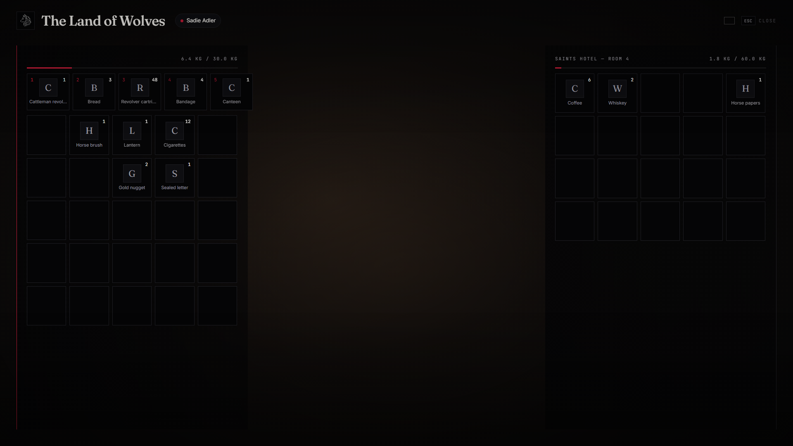

<!--
    lxr-inventory — LXRCore inventory UI, stashes, drops, shops
    Developer: iBoss21 / LXRCore · https://www.lxrcore.com
    © 2026 iBoss21 / LXRCore | lxrcore.com | All Rights Reserved
-->


# lxr-inventory — Inventory for LXRCore v3


Item logic (weight, slots, stacking, persistence of the player's satchel) is
owned by **lxr-core**. This resource adds what players see and touch: the
drag-and-drop interface, hotbar keys, stashes, ground drops, shops, giving
items and searching other players.




## Why v2

| v1 (qb-inventory clone) | v2 |
|---|---|
| Bootstrap, jQuery, jQuery-UI, FontAwesome and Google Fonts from CDNs | vanilla HTML/CSS/JS, LXRCore design tokens, works offline |
| "remove then add" moves — items vanished or duplicated when the add failed | one move engine (`server/containers.lua`): validate everything, then mutate; swap only when both sides fit |
| any client could open any stash / player and push moves into it | per-player **session**: moves are only accepted into the container the server opened for you; stashes/drops are single-user while open |
| crafting, attachments, GTA weapon images | removed (crafting belongs to its own resource) |
| direct SQL in the resource | stash table created through the core migration runner; player items saved by the core |

## Features

* Player satchel + secondary panel (stash · ground · shop · other player), drag & drop, split by amount, double-click to move/use.
* Hotbar: slots 1–5 on keys 1–5 (`RegisterKeyMapping`, rebindable). Open with TAB.
* Stashes: `Config.Stash.presets` by id prefix; other resources open them with `TriggerEvent('inventory:server:OpenInventory', 'stash', id, { label, slots, maxweight })`.
* Ground drops: created where the player stands, prop + marker, expire when empty or after `Config.Drops.expireMs`.
* Shops: `Config.Shops.registered` or `exports['lxr-inventory']:RegisterShop(id, { label, items })`; buying charges the account first and refunds on failure.
* Give to nearest player (server checks distance) · search / rob when you are on-duty law or the target is cuffed / dead.
* Item box toasts (`inventory:client:ItemBox`), use / drop animations.
* English + Georgian locales.
* Clean slot layout: weight text removed from grid slots (shown in tooltip/detail only); shop prices stay visible on shop slots.
* Shop buy flow: clicking **Buy** on a shop item posts a dedicated `buy` callback that charges cash and adds the item atomically via the server.

## The satchel (3.1)

* **Find things** — search, category chips (food, liquor, medicine, weapons, ammo, tools, materials, hunting, papers…), sort by slot, name, amount or weight; the server's **Sort** packs the satchel.
* **Move things** — drag between grids with a ghost under the cursor (the amount field or the mouse wheel sets how many), double-click to use / put / take / buy, right-click for the menu: use, give to the nearest, drop, split, put / take.
* **Transfer** — put everything, put matching, take everything, take matching between the satchel and a chest, drop or wagon (`lxr-inventory:server:transfer`).
* **What a tile tells you** — amount, weight, hotbar key, rarity as the border (uncommon → legendary), the illegal mark, a **freshness** line for food that spoils and a **condition** line for guns.
* **Decay** — the catalog's `decay = { hours, into }` now runs: items are stamped when first seen and become their spoiled form on time (`Config.Decay`).
* **Item boxes** — received / removed toasts with the item picture.
* **Trade** (3.0) — `/trade` asks the closest player; both see a trade table: your offer (drag in, drag out), their offer, a cash offer, Confirm. What is offered leaves the satchel into escrow at once; the swap happens only when both have confirmed and both can carry and pay — otherwise everything goes back (cancel, ESC, walking away, a disconnect; an offline owner's goods wait in a return stash swept on the next login). Any change to either side clears both confirmations. `Config.Trade`.
* **Drag modifiers** — Shift + drag moves the whole stack, Alt + drag half of it; otherwise the amount field (or the mouse wheel over the tile) decides.

## Building the interface

Vite + React + TypeScript: source in `ui/`, built output in `html/` (`cd ui && npm install && npm run build`). `style.css` uses kit tokens only; `tools/kit_check.py` guards it.

## Install

```cfg
ensure lxr-core
ensure lxr-inventory
```
No SQL to import: `stashitems` is created on first start by the core migration runner.

## API

| | |
|---|---|
| `exports['lxr-inventory']:OpenInventory(src, kind, id, data)` | `kind` ∈ `stash`, `drop`, `ground`, `shop`, `otherplayer` |
| `exports['lxr-inventory']:CloseInventory(src)` | |
| `exports['lxr-inventory']:GetStashItems(id)` / `AddStashItem(id, name, amount, info)` / `RemoveStashItem(id, name, amount)` / `ClearStash(id)` | |
| `exports['lxr-inventory']:RegisterShop(id, def)` | |
| `exports['lxr-inventory']:GetSlotData(src, slot)` | |
| `exports['lxr-inventory']:TradeRequest(src, targetSrc)` | the face-to-face trade (also `/trade` → the closest player) |
| item surface for third-party scripts | `AddItem(src, name, amount, slot?, info?, reason?)`, `RemoveItem(src, name, amount, slot?, reason?)`, `HasItem(src, items, amount?)`, `GetItemCount`, `GetItemByName`, `GetItemsByName`, `GetItemBySlot`, `GetInventory`, `CanAddItem`, `GetTotalWeight`, `GetFreeWeight`, `GetSlots` (used, free), `GetSlotsByItem`, `GetFirstSlotByItem`, `SetItemData(src, slot, info)`, `ClearInventory(src, keep?)`, `UseItem(src, item)`, `OpenInventoryById(src, target)`, `CreateInventory(id, { slots, weight, label })`, `DeleteInventory(id)` — all thin wrappers over the core's `LXRCore.Inventory` |
| events kept for legacy resources | `inventory:server:OpenInventory`, `inventory:client:ItemBox`, `inventory:server:UseItemSlot`, `lxr-inventory:client:giveAnim`, `inventory:client:DropItemAnim`, `lxr-inventory:server:GetStashItems` (callback) |
| commands | `/giveitem id item amount` (admin), `/clearinv id` (admin), `/resetstash id` (admin) |

Item images: put `html/images/<item>.png` files in place (see the folder README); the UI shows a lettered tile when an image is missing.

> © 2026 iBoss21 / LXRCore | [lxrcore.com](https://www.lxrcore.com) | All Rights Reserved
